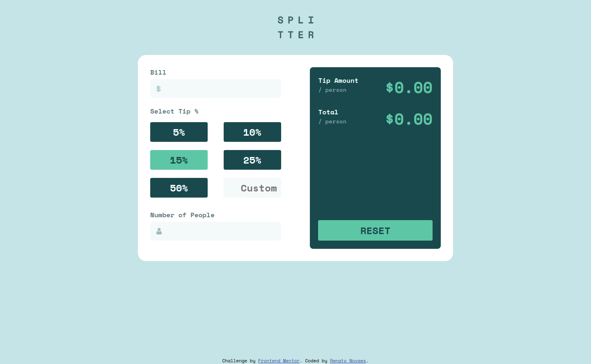
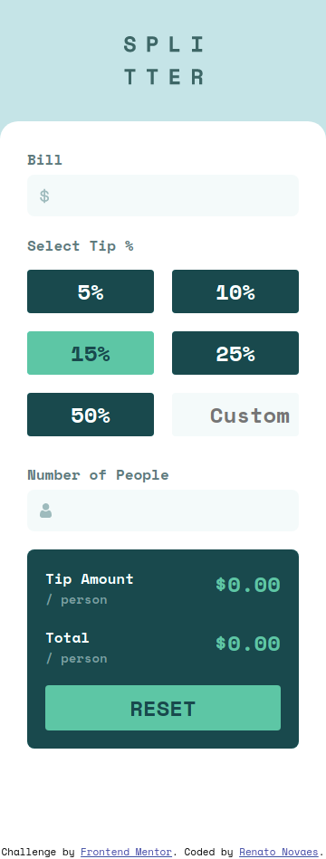

# Frontend Mentor - Tip calculator app solution

This is a solution to the [Tip calculator app challenge on Frontend Mentor](https://www.frontendmentor.io/challenges/tip-calculator-app-ugJNGbJUX). Frontend Mentor challenges help you improve your coding skills by building realistic projects.

## Table of contents

- [Overview](#overview)
  - [The challenge](#the-challenge)
  - [Screenshot](#screenshot)
  - [Links](#links)
- [My process](#my-process)
  - [Built with](#built-with)
  - [What I learned](#what-i-learned)
  - [Continued development](#continued-development)
  - [Useful resources](#useful-resources)
- [Author](#author)

## Overview

### The challenge

Users should be able to:

- View the optimal layout for the app depending on their device's screen size
- See hover states for all interactive elements on the page
- Calculate the correct tip and total cost of the bill per person

### Screenshot

### Links

- Live Site URL: [Netlify](https://boring-ritchie-72af82.netlify.app/)

## My process

### Built with

- Semantic HTML5 markup
- CSS custom properties
- Flexbox
- Mobile-first workflow

### What I learned

I've learned a soft skill today. I thought I wouldn't be able to finish this project in one day. But still I set this goal.  
  
This project had my full focus and priority for today. And here it are. Done in one day.

### Continued development

I need to make a better use of the modules feature we have for JavaScript. It can become my code a lot more clean and readable.
## Author

- Website - [Renato Novaes](https://www.renatonovaes.dev)
- Linkedin - [Linkedin](https://www.linkedin.com/in/renatonovaes49)